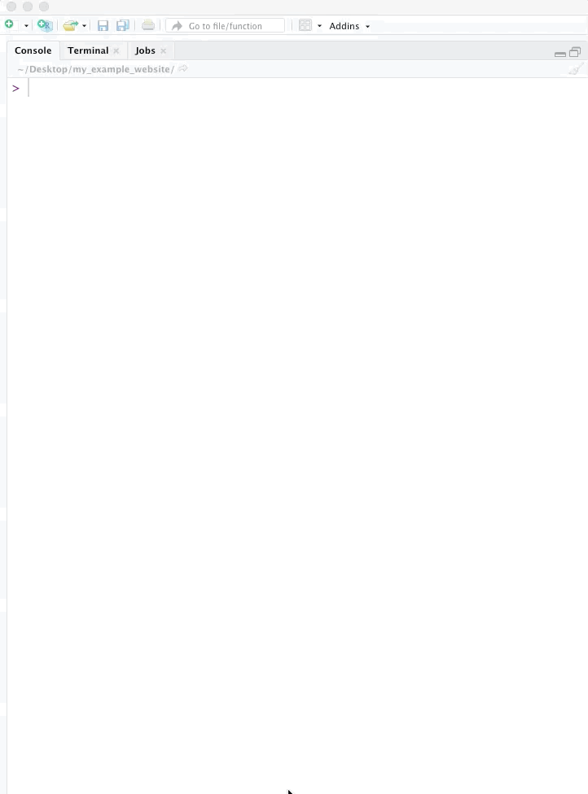
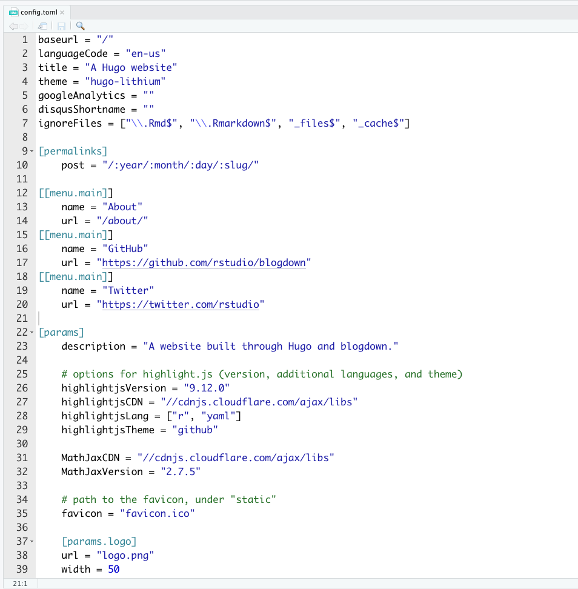
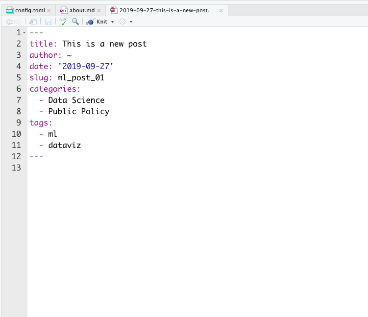
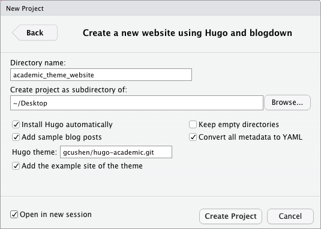

```{r setup, include=FALSE}
options(htmltools.dir.version = FALSE)
knitr::opts_chunk$set(echo = T,message=F,error=F,warning = F,python.reticulate=T)
Sys.setenv(RETICULATE_PYTHON = '/usr/local/bin/python3') # For any python examples... if any. 
```

<br><br><br><br><br><br><br>

.center[
### All slides and materials can be found at 
### [http://ericdunford.com/blogdown_workshop](http://ericdunford.com/blogdown_workshop)
]


---

<br><br><br><br><br><br>
# `I web, therefore I am.` <br><br> - Yihui Xie

---

# Why have a website?

--

<br>

### Professional visibility 

--

<br>

### Personal archive

--

<br>

### Living Resume

---

### [`blogdown`: Creating Websites with R Markdown](https://bookdown.org/yihui/blogdown/)

.center[


]

---

## Static vs. Dynamic sites

#### Dynamic
> a dynamic site relies on a server-side language to do certain computing and sends potentially different content depending on different conditions. A common language is PHP, and a typical example of a dynamic site is a web forum. 

--

#### Static
> A static site often consists of HTML files (with optional external dependencies like images and JavaScript libraries), and the web server sends exactly the same content to the web browser no matter who visits the web pages.

--

- [**Hugo**](https://gohugo.io/) &rarr; Static website generator; fast; flexible; maintained

- [**Hugo**](https://gohugo.io/) is versatile but lacks [**`R` Markdown**](https://rmarkdown.rstudio.com/) support (uses the "[Blackfriday](https://github.com/russross/blackfriday)" markdown engine instead of the more powerful "[pandoc](https://pandoc.org/)"). 

- This is where `Blogdown` comes in and becomes useful.


---

class: inverse, center, middle

# Let's build a website <br> in 4 easy steps <br>with `blogdown`

---

### Step 1: Install Blogdown

.center[

]

---

### Step 2: Install Hugo


.center[

]

---

### Step 3: Create a new website as a new `R` project

.center[

]

---

### Step 3: Create a new website via the `R` console

.center[

]

---

### Step 4: Spin up the site locally 

.center[
.pull-left[

#### _Via the `R` Console_

].pull-right[
#### _Via `R` Addins_
]
]

---

### Basic Elements of a Hugo-based Website

### (1) `config.toml`

- Global settings for your site

### (2) `content/`

- Write `R` Markdown source files.
- Page tab content (e.g. `about.md`)

### (3) `public/`

- Publishable directory - "output" of blogdown
- Upload to server that take static websites (like `netifly.com`)
- You're live!


---

### Edit `config.toml` 



---

### Edit existing content in the Hugo template


.center[

]

---

### Add content

Add **new blog posts** programmatically.

```{r,eval=F}
blogdown::new_post(title = "This is a new post",
                   categories = c("Data Science","Public Policy"),
                   tags = c("ml","dataviz"), 
                   slug = "ml_post_01", # link reference
                   ext = ".Rmd") # R Markdown 
```

.center[

]

---

### Add content


.center[

]

---

### Uploading Images 

**(1) Use the upload `Addin`**

.center[
{width=80% height=80%}
]

**(2) Manually enter the file path**

```
{width=80% height=80%}
```

---

## Publishing the Site

- Many ways to publish a static site:

  - [Netifly](https://www.netlify.com/?gclid=Cj0KCQjw5rbsBRCFARIsAGEYRwesUCspKkrMFYSoFojXV7FfCA53do-grAsT3eY8k3DInWWxu2BTufAaAt5SEALw_wcB)
  
  - [Updog](https://updog.co/)
  
  - [Github](https://github.com/) - via Github Pages


<br>

- Must "build" website before publishing

```{r, eval=F}
blogdown::build_site()
```

<br>

- Only the rendered `public/` folder matters 
  
  - The `public/` is where the git repository needs to be initiated.
  
  - The `public/` is what you drag and drop into netifly/updog. 
  
---

### Publishing to `Github` in eight easy steps...

1. Create a **Github account**
2. Create a **Repository**
  - Repository must be named "`username.github.io`"
  - _Don't_ initialize a `README`
3. **Enable Github Pages** for the Repository
  - Click the 'Settings' button on the repository home page.
  - Click and choose a Jekyll theme ("Theme Chooser" under "GitHub Pages" and click `Choose a Theme`)
      - we must choose a theme even if we are not using Jekyll (which we aren't.)
  <!-- - Scroll down to the 'GitHub Pages' section and choose the master branch for the source. -->
4. **Initialize** a `git` repository in the `public/` folder
5. **Link** your repository to the Github Remote.
  ```
  git push -u origin master
  git remote add origin https://github.com/username/username.github.io.git
  ```
6. Add all items in the `public/` folder, commit, push
7. Wait a few moments.
8. **Visit your site!** &rarr; `https://username.github.io`

See here for more on [Github Pages](https://pages.github.com/)

---

### Customizing your domain

<br><br>

Don't like the provided url, buy a domain name:

- [Namecheap](https://www.namecheap.com)
- [GoDaddy](https://www.godaddy.com)
- [Domain.com](https://www.domain.com/domains/)
- etc.

<br><br>

Adding a custom domain is as easy as adding a file titled `CNAME` containing your custom domain. 

- See this Github help for more information: [Adding a custom domain](https://help.github.com/en/articles/using-a-custom-domain-with-github-pages)

---

### Finding a Hugo theme for that suits you

Go to [https://themes.gohugo.io/](https://themes.gohugo.io/) for a complete list of all maintained Hugo themes. 

.center[

]

---

### Using desired Hugo theme 

```{r,eval=F}
blogdown::new_site(dir="~/Desktop/academic_theme_website",
                   theme = "gcushen/hugo-academic")
```

#### .center[... or ...]

.center[

]

---

## Designing a Portfolio

#### Useful Examples Websites
<!-- - [David Venturi](http://davidventuri.com/portfolio) -->
- [Reproducible Random Thoughts](https://yonicd.netlify.com/)
- [Jesse Mostipak](https://www.jessemaegan.com/)
- [The Little Dataset that Could](https://thelittledataset.com/)
- [Shirin Elinghorst](https://www.shirin-glander.de/)

#### Useful Readings on developing a portfolio
- [How to Build a Data Science Portfolio](https://towardsdatascience.com/how-to-build-a-data-science-portfolio-5f566517c79c) - Michael Galarnyk
- [4 Dos and Don'ts to Building a Data Science Portfolio](https://blog.brainstation.io/how-to-build-a-data-science-portfolio-4-dos-and-donts/)
  - Don’t Include Your Whole Body of Work
  - Do Showcase Your Communication Skills
  - Do Consider GitHub Instead of a Website
  - Don’t Just Show Code in Isolation
- [How You Should Create A Data Science Portfolio That Will Get You Hired](https://www.datascienceweekly.org/articles/how-you-should-create-a-data-science-portfolio-that-will-get-you-hired)

#### Useful Posts on dealing with `Blogdown` related issues
- [A Spoonful of Hugo: Troubleshooting Your Build](https://alison.rbind.io/post/2019-03-04-hugo-troubleshooting/)

---

<br>
.center[
# Thanks!
<br>

.center[
### Eric Dunford 
_McCourt School of Public Policy_<br>
**_Georgetown University_**<br>
eric.dunford@georgetown.edu<br>
[ericdunford.com](http://ericdunford.com/)
]
]

